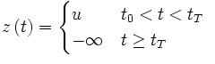
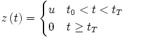
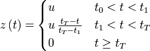
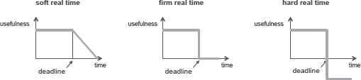
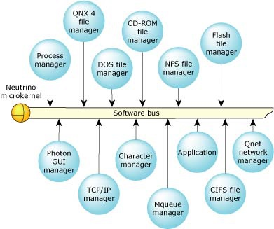
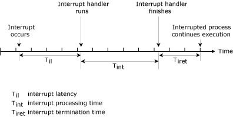
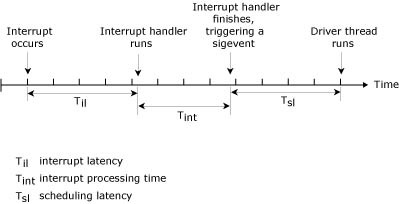
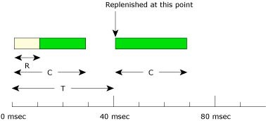
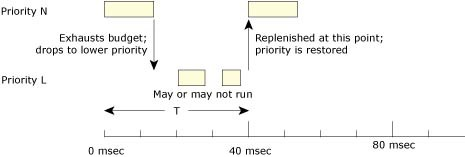
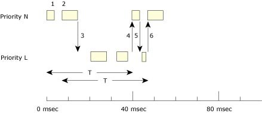

== Klasyfikacja systemów czasu rzeczywistego 
.Systemy o ostrych ograniczeniach czasowych
* (ang. hard real-time) - przekroczenie terminu powoduje poważne, 
	a nawet katastrofalne skutki jak np. zagrożenie życia lub zdrowia luzi, 
	uszkodzenie lub zniszczenie urządzeń, 
	przy czym nie jest instotna wielkość przekroczenia terminu a jedyne sam fakt jego przekroczenia.

.Systemy o mocnych ograniczeniach czasowych
* (ang. Firm real-time) - gdy fakt przekroczenia terminu powoduje całkowitą nieprzydatność wypracowanego przez system wyniku,
	jednakże nie oznacza to zagrożenia dla ludzi lub sprzętu.
	Pojęcie to stosowane jest głównie w opisie teoretycznym baz danych czasu rzeczywistego.

.Systemy o miękkich ograniczeniach czasowych 
* (ang. soft real-time) - gdy przekroczenie pewnego czasu powoduje negatywne skutki tym poważniejsze,
	im bardziej ten czas został przekroczony.

=== Wykresy dla systemów czasu rzeczywistego

== Architektura mikrojądra

* System operacyjny zaprojektowany w oparciu o architekturę mikrojądra zbudowany jest z niewielkiego jądra dostarczającego minimalnego zestawu usług dla grupy współpracujących z nim opcjonalnych procesów w celu osiągnięcia pełnej, niezbędnej funkcjonalności.

* Rzeczywistym celem podczas projektowania mikrojądra jest osiągnięcie wysokiej modularności systemu.
	Mały rozmiar jądra jest efektem ubocznym, a nie celem samym w sobie.
* Usługi IPC jądra "scalają" elementy składowe systemu operacyjnego. 
	W konsekwencji efektywność i elastyczność tych usług ma decydujący wpływ na wydajność całego systemu operacyjnego.
* System operacyjny zaimplementowany jako grupa współpracujących procesów zarządzanych przez mikrojądro. 
	W konsekwencji procesy urzytkownika mogą być zarówno procesami aplikacji, jak i procesami rozszrzającymi funkcjonalność systemu.
* System jest systemem "otwartym" i łatwo rozbudowalnym przy czym zwiększenie funkcjonalności system nie wymaga ingtegracji w jego podstawowe elementy składowe.

== Opóźnienie przerwania i opóźnienie uruchamiania

* W systemach czasu rzeczywistego niezwykle ważne aby czas pomiędzy zdarzeniem zewnętrznym, a reakcją systemu na to zdarzenie był jak najktrótszy. Czas ten nazywany jest opóźnieniem lub zwłoką (ang. latency).
* Przy rozpatrywaniu systemu przerwań, szczególną uwagę należy zwrócić na dwie formy opóźnienia: opóźnienie przerwania (ang. interrupt latency) i opóźnienie uruchomienia (ang. sheduling latency).
* Czasy opóźnień znacząco mogą różnić się w zależnośći od prędkości procesora i innych czynników.

.Opóźnienie przerwania (ang. interrupt latency)
* Czas od wystąpienia przerwania sprzętowego do wykonania pierwszej instrukcji procedury obsługi tego przerwania (ang. interrupt handler) przez sterownik urządzenia zgłaszającego przerwanie.
* System pozostawia przerwania włączone niemalże przez cały czas, więc opóźnienie to zwykle nieznaczące. Pewne krytyczne sekcje kodu jądra systemu wymagają jednak tymczasowego wyłaćżenia przerwań. 
	Maksymalny czas kiedy przerwania są wyłączone przez system definiuje najgorszy przypadek zwłoki przerwania.

.Opóźnienie uruchamiania (ang. sheduling latency)
* W pewnych przypadkach niskopoziomowa procedura obsługi przerwania musi uruchomić procedurę wyższego poziomu.
	W przypadku takiego scenariusza procedura obsługi przerwania kończy się wysyłając zdarzenie do innego wątku. 
	Wprowadzato drugą formę opóźnienia: opóźnienie uruchamiania.
* Jest to czas od wykonania ostatniej instrukcji sterownika niskopoziomowego do wykonania pierwszej instrukcji sterownika wyższego poziomu.
	Zwykle jest to czas przełączania kontekstu i jest zwykle dłuższy od czasu opóźnienia przerwania.
	

== Uruchomianie sporadyczne (ang. sporadic sheduling)

* Umożliwia obsługę przez wątek zdarzeń aperiodycznych bez zaburzeń terminowości innych wątków lub procesów.
* Podobnie jak w algorytmie FIFO wątek jest wykonywany dopóki nie zostanie zablokowany lub wywłaszczony przez wątek o wyższym priorytecie.
	Podobnie jak w algorytmie adaptacyjnym zostanie zmniejszony priorytet wątku, z tym że kontrola nad zachowaniem wątku jest dużo większa.

* Zachowanie wątku może być kontorlowane przez następujące parametry: 
** Initial budget (C) - czas, przez który wątek może być realizowany z normalnym priorytetem (N), 
	zanim jego priorytet nie zostanie obniżony do priorytetu niskiego (L).
** Low prioryty (L) - poziom do którego zostaje obniożony priorytet wątku.
** Replenishment period (T) - okres czasu po którym następuje operacja przywracania (ponowne przydzielenie Initial budget).
** Max number of pending replenishments - maksymalna liczba operacji przywracania.

* Po wykorzystaniu Initial budget priorytet wątku zostaje obniżony.
	Może być on nadal wykonywany z niższym priorytetem lub nie, w zależności od priorytetów innych wątków.
* Operacja przywracania przywraca normalny priorytet wątku.
	Gwarantuje to, że w poprawnie skonfigurowanym systemie wątek ma możliwość być wykonywanym maksymalnie przez czas C w każdym okresie czsu T. 
	Oznacza to, że wątek wykonywany z priorytetem N zużywa jedynie C/T część zasobów systemowych.
* W momencie zablokowania wątku zostaje zaplanowana dla niego operacja przywracania (po czasie T od momentu jego uruchomienia),
	przy czym priorytet wątku przywracany jest na czas równy  czasowi wykonywania do momentu zablokowania.
* Kiedy wątek zostanie zablokowany wielokrotnie, zostanie uruchomionych wiele operacji przywracania w różnych momentach czasowych.
	Oznacza to, że wątek w okresie T będzie wykonywany z priorytetem N przez czas C, jednak czas C nie musi być ciągły.

== Polityka QoS w sieci opartej na protokole Qnet

* Quality of Service (QoS) jest czynnikiem często pojawiającym się w systemach kontrolnych czasu rzeczywistego. 
	W sieci Qnet QoS sprowadza się do wyboru medium transmisyjnego.
	W systemach z dwoma lub więcej interfejsami sieciowymi Qnet wybiera jeden zgodnie z założoną polityką QoS.
* W przypadku systemów z jednym interfejsem sieciowym polityka QoS nie ma zastosowania.
* Qnet wspiera transmisję w środowisku wielu sieci i dostarcza polityk określających  jaki sposób powinien zostać dokonany wybór interfejsu sieciowego: 
** loadbalance (domyślna) - net ma swobodny wybór wśród dostępnych sieci i rozdziela transmisję pomiędzy nie. 
** preffered - Qnet wykorzystuje wskazany interfejs i ignoruje posostałe (poza przypadkiem awarii sieci preferowanej).
** exclusive - Qnet używa tylko jednej sieci, ignoruje pozostałe, nawet jeśli wskazana uległa awarii.
* Do czerpania pełnych korzyści z QoS sieci powinny być fizycznie rozdzielone.

.Qnet i pojedyńcza sieć
* Jeżeli połączenie ulegnie awarii, Qnet rozpozna awarię, ale nie przełączy się na drugi połączenie, gdyż oba wiodą do tego samego huba 
	Do aplikacji należy wyjście z sytuacji awaryjnej i wznowienie połączenia, Qnet przełączy się wtedy na działającą linię.

.Qnet i fizycznie rozdzielone sieci 
* Jeżeli nastąpi awaria Qnet automatycznie przełączy się na drugą linię.
	Aplikacja nie będzie powiadomiona o awarii.